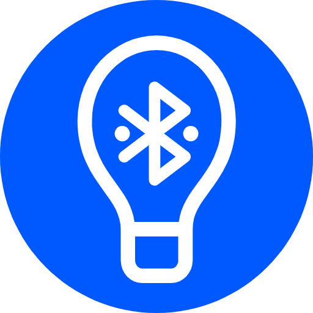

<!-- PROJECT LOGO -->
 

  

<h3 align="center">BLightESP32</h3>

  

    Software module for normalization of the psycho-emotional state and personalization of the environment through artificial lighting
  

<!-- ABOUT THE PROJECT -->
## About

This application allows you to control the color temperature and brightness of the LED lamp via PWM. Management is carried out through the mobile application [BLight](https://github.com/AndrewLaptev/ble_light_mobile) via Bluetooth Low Energy.

### Features:
* ensuring the work of several clients connected through the BLight mobile application at once
* control of the light mode based on the preferences of all connected clients (consensus)
* smooth brightness and color temperature control
* authorization via a token of GATT-connected clients to access the light mode management service

### Built With

* [![ESP-IDF][esp-idf-shield]][esp-idf-url]
* [![Cmake][cmake-shield]][cmake-url]
* [![PlatformIO][platformio-shield]][platformio-url]

### Requirements
* ESP32 WROOM DevKit v1 or ESP32 Wemods D1 mini
* OC Ubuntu/Windows
* VScode
* Platformio

### Documentation
The application documentation is available in the [GitHub wiki](https://github.com/AndrewLaptev/ble_light_esp32/wiki) of this repository. There you can find instructions for installing the application from the source codes, using and configuring the use, as well as all technical information about the project.

<!-- ACKNOWLEDGMENTS -->
## Acknowledgments
The application was developed within the framework of the research project "Development of mechanisms for designing the processes of users' vital activity into the ecosystem of their digital assistants" No. 621308

<!-- MARKDOWN LINKS & IMAGES -->
<!-- https://www.markdownguide.org/basic-syntax/#reference-style-links -->
[esp-idf-shield]: https://img.shields.io/badge/ESP--IDF-D5DDDF?style=for-the-badge&logo=espressif
[esp-idf-url]: https://github.com/espressif/esp-idf
[cmake-shield]: https://img.shields.io/badge/Cmake-000000?style=for-the-badge&logo=cmake
[cmake-url]: https://cmake.org
[platformio-shield]: https://img.shields.io/badge/Platformio-FE864C?style=for-the-badge
[platformio-url]: https://platformio.org
